# 👋 Hi there, I'm **Varun Tyagi**

<div align="center">
  
### 🚀 Full Stack Developer | DSA Enthusiast | Problem Solver

*B.Tech in CSE Graduate | MERN/PERN Stack Expert | AI Integration Specialist | Open Source Contributor*


<p align="center">
  
</p>


[](https://github.com/varuntyagii?tab=followers)
[](https://github.com/varuntyagii)

</div>

---

## 🎯 **About Me**

```javascript
const varunTyagi = {
    location: "Delhi, India 🇮🇳",
    education: "B.Tech in Computer Science Engineering",
    currentRole: "Full Stack Developer",
    currentFocus: ["AI Integration", "Advanced React Patterns", "System Design"],
    techStack: {
        frontend: ["React", "Next.js", "TypeScript", "Tailwind CSS"],
        backend: ["Node.js", "Express.js", "Python", "FastAPI"],
        databases: ["MongoDB", "PostgreSQL", "Redis"],
        deployment: ["AWS", "Vercel", "Netlify"],
        tools: ["Git", "Docker", "Prisma", "Clerk"]
    },
    currentlyBuilding: "AI-powered career coaching platform",
    dailyRoutine: ["Code", "Learn", "Solve DSA", "Contribute"],
    funFact: "I turn coffee into code and bugs into features! ☕️➡️💻",
    lifePhilosophy: "Code with purpose, learn with passion, share with community"
};

console.log("Welcome to my GitHub profile! 🚀");
```

---

## 🛠️ **Complete Tech Arsenal**

<div align="center">

### **🎨 Frontend Development**


### **⚙️ Backend Development**


### **🗄️ Databases **


### **🧠 Programming Languages**


### **🔧 Development Tools**


</div>

---

## 🎨 **Featured Projects**

<div align="center">
  
### 🏆 **Flagship Applications**

</div>

<table>
<tr>
<td width="50%">

### 🤖 **AI Career Coach**
**Next-Gen Career Development Platform**

🔹 **Tech Stack**: React 19, Next.js 15, TypeScript, Tailwind CSS, NeonDB, Prisma, Clerk Auth, Gemini AI API  
🔹 **Key Features**: 
- AI-powered resume generation and optimization
- Interactive interview preparation with real-time feedback  
- Personalized career path recommendations
- Cover letter automation with industry insights

[](https://github.com/varuntyagii/AI-career-Coach)
[](https://ai-career-coach-b2z4.vercel.app)
[](https://ai-career-coach-b2z4.vercel.app)

</td>
<td width="50%">

### 🌤️ **Smart Weather Dashboard**
**Real-time Weather Intelligence**

🔹 **Tech Stack**: React, Weather API, Chart.js, CSS3  
🔹 **Key Features**: 
- Real-time weather data with 7-day forecasts
- Interactive weather maps and visualizations
- Location-based automatic detection
- Weather alerts and notifications system

[](https://github.com/varuntyagii/weather-app)
[](https://weather-app-sepia-nu-63.vercel.app)
[](https://weather-app-sepia-nu-63.vercel.app)

</td>
</tr>
<tr>
<td width="50%">

### 💼 **Professional Portfolio**
**Interactive Personal Brand**

🔹 **Tech Stack**: React, CSS3, Framer Motion, Responsive Design  
🔹 **Key Features**: 
- Smooth animations and micro-interactions
- Dynamic project showcase with filtering
- Integrated contact form with email service
- Mobile-first responsive design

[](https://github.com/varuntyagii/Portfolio)
[](https://portfolio-seven-xi-62.vercel.app)
[](https://portfolio-seven-xi-62.vercel.app)

</td>
<td width="50%">

### 🚀 **Upcoming Projects**
**Innovation in Progress**

🔹 **In Development**: 
- **E-commerce Platform** (MERN + Stripe)
- **Real-time Chat App** (Socket.io + Redis)
- **Task Management Tool** (Next.js + PostgreSQL)
- **DSA Visualizer** (Three.js + React)

[](https://github.com/varuntyagii)
[](https://github.com/varuntyagii)

</td>
</tr>
</table>

---

## 📊 **GitHub Analytics & Performance**

<div align="center">

### 📈 **Comprehensive GitHub Statistics**


### 🔥 **GitHub Streak Analytics**


### 📈 **Contribution Activity Graph**


</div>

---

## 🏅 **Coding Practice & Competitive Programming**

<div align="center">

### **💻 Problem Solving Platforms**

[](https://leetcode.com/u/varun_tyagi/)
[](https://www.geeksforgeeks.org/user/varuntyagii/)
[](https://www.codechef.com/users/varun_tyagi009)

### **📈 LeetCode Statistics**


</div>

---

## 🌐 **Connect & Collaborate**

<div align="center">

### **🤝 Professional Networks**

[](https://portfolio-seven-xi-62.vercel.app/)
[](mailto:varuntyagi0099@gmail.com)
[](https://linkedin.com/in/varuntyagi09)
[](https://portfolio-seven-xi-62.vercel.app/)

### **📱 Social Presence**

[](https://twitter.com/varun_tyagi0)
[](https://instagram.com/varuntyagii_)
[](https://www.youtube.com/@creative_0900)

### **💻 Developer Communities**

[](https://stackoverflow.com/users/23142951/varun-tyagi)
[](https://codepen.io/varun-tyagi)
[](https://dev.to/varuntyagi)

</div>

---

## 🛠️ **Open Source Contributions**

<div align="center">

### **🌟 My Open Source Impact**


</div>

**🔧 Key Contribution Areas:**
- **React Component Libraries** - Building reusable, accessible UI components
- **Developer Tools** - Creating productivity-enhancing tools and utilities  
- **Educational Content** - DSA tutorials, coding best practices, and learning resources
- **API Integrations** - Open-source API wrappers and integration examples
- **Documentation** - Improving project documentation and developer experience

---

## 🎯 **Current Focus & Goals**

```mermaid
graph TD
    A[🎯 2025 Goals] --> B[🚀 Full Stack Mastery]
    A --> C[🤖 AI Integration]
    A --> D[🌟 Open Source Impact]
    A --> E[💼 Career Growth]
    
    B --> B1[Advanced Next.js Patterns]
    B --> B2[System Design Mastery]
    B --> B3[Cloud Architecture]
    
    C --> C1[LLM Integration]
    C --> C2[AI-Powered Apps]
    C --> C3[Machine Learning Basics]
    
    D --> D1[Major OSS Contributions]
    D --> D2[Tech Community Building]
    D --> D3[Mentoring Developers]
    
    E --> E1[Senior Developer Role]
    E --> E2[Technical Leadership]
    E --> E3[Industry Recognition]
```

<div align="center">



</div>

**🎯 Current Sprint:**
- 🔭 **Building**: AI-powered SaaS applications with modern tech stack
- 🌱 **Learning**: Advanced system design patterns and microservices architecture  
- 👯 **Collaborating**: Open source projects and developer community initiatives
- 🤔 **Exploring**: AI/ML integration in web applications and automation tools
- 💬 **Sharing**: Knowledge through blogs, tutorials, and mentoring sessions
- ⚡ **Daily**: Solving DSA problems and contributing to open source projects

---

## 🧠 **Daily Inspiration**

<div align="center">


### **📊 Weekly Coding Activity**

<!--START_SECTION:waka-->
<!-- Coding activity will be shown here -->
<!--END_SECTION:waka-->

</div>

---

## ☕ **Support My Journey**

<div align="center">

**🚀 If you find my projects helpful, consider supporting my open source journey!**

<a href="https://buymeacoffee.com/varuntyagi">

</a>
<a href="https://github.com/sponsors/varuntyagii">

</a>
<a href="https://paypal.me/varuntyagi">

</a>

**⭐ Star my repositories • 🔀 Fork interesting projects • 📢 Share with the community**

</div>

---


<div align="center">

## ✨ **Thank you for visiting my profile!** ✨

### 🌟 **Let's build something amazing together!** 🌟

**"Every expert was once a beginner. Every professional was once an amateur. Every icon was once an unknown."**

---


</div>

---

<!-- 
IMPLEMENTATION NOTES FOR STREAK STATS:

1. For streak stats to work automatically:
   - Make sure you have consistent commit activity
   - The streak counter tracks consecutive days with commits
   - Private repository commits also count if you enable them in settings

2. To improve streak visibility:
   - Enable "Private contributions" in your GitHub profile settings
   - Make commits regularly (even small documentation updates count)
   - Use GitHub Actions to automate some updates (like this README)

3. Alternative streak stat URLs if the main one doesn't work:
   - https://streak-stats.demolab.com?user=varuntyagii&theme=radical
   - https://github-readme-streak-stats.herokuapp.com?user=varuntyagii&theme=radical
   - https://streak-stats-phi.vercel.app?user=varuntyagii&theme=radical

4. For GitHub Stats to work better:
   - Make sure your repositories are public or enable private repo stats
   - Verify your username spelling is correct
   - Clear cache by adding ?cache=false to URLs temporarily

5. To add automatic activity updates:
   - Set up GitHub Actions workflow
   - Use actions like gautamkrishnar/blog-post-workflow
   - Add WakaTime integration for coding activity
-->
